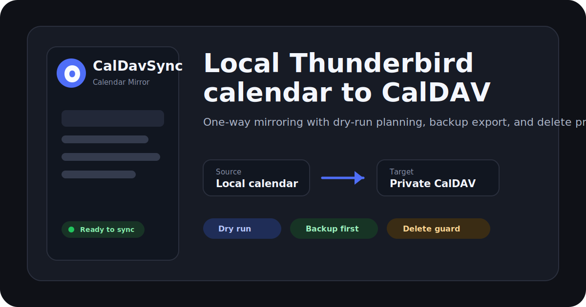

<p align="center">
  
</p>

<h1 align="center">CalDavSync</h1>

<p align="center">
  One-way Thunderbird local calendar mirroring to a private CalDAV collection.
</p>

<p align="center">
  
  
  
  
</p>

<p align="center">
  
</p>

CalDavSync mirrors one local Thunderbird calendar to one CalDAV collection
without configuring that remote calendar in Thunderbird. The local calendar is
authoritative: remote edits are not imported, and the next local change
overwrites the mirrored remote copy.

The extension writes passive `VEVENT` copies and strips top-level iTIP
`METHOD` properties so it does not intentionally accept invitations, send
replies, or trigger invitation workflows.

## Highlights

| Area | What it does |
| --- | --- |
| One-way mirror | Pushes local Thunderbird events to a dedicated CalDAV collection. |
| Safety checks | Includes dry-run planning, backup export, and a 30% default bulk-delete guard. |
| Credentials | Stores the CalDAV password in Thunderbird's native Password Manager. |
| Reviewability | Ships readable JavaScript, no bundling, no minification, and no remote code. |
| Compatibility | Targets Thunderbird 128+ and uses a Thunderbird Experiment API for calendar access. |

## How It Works

```text
Thunderbird local calendar
        |
        | export selected local events
        v
CalDavSync mirror planner
        |
        | create / update / delete managed VEVENT files
        v
User-configured CalDAV collection
```

- A local create writes `<UID>.ics` to the CalDAV collection.
- A local update overwrites the matching remote event.
- A local delete deletes only events previously created by this extension.
- Remote changes are ignored.
- Mirrored events include `X-LOCAL-CALDAV-MIRROR-MANAGED:TRUE`.

## Install For Local Testing

Because CalDavSync uses a Thunderbird Experiment API, the most reliable local
test path is Thunderbird's temporary add-on loader:

1. Open Thunderbird.
2. Go to Add-ons and Themes.
3. Open the gear menu and choose Debug Add-ons.
4. Choose Load Temporary Add-on.
5. Select this repository's `manifest.json`.

Temporary add-ons are removed when Thunderbird restarts.

## Configure

1. Open the extension options.
2. Select a local calendar. Non-local calendars are disabled.
3. Enter a dedicated HTTPS CalDAV collection URL, for example
   `https://example.com/dav/calendars/user/local-mirror/`.
4. Enter credentials. Leave the password blank later to keep the saved password.
5. Click Test connection.
6. Click Download backup.
7. Click Dry run and review the planned operations.
8. Click Sync now.

Use a dedicated, preferably empty CalDAV collection for the first test. If no
local calendars appear, open Advanced troubleshooting, click Diagnostics, and
copy the Status output.

## Important Limitations

- The CalDAV password is stored in Thunderbird's native Password Manager.
  Anyone with full access to the Thunderbird profile may still be able to
  recover saved credentials.
- CalDAV collection URLs must use HTTPS and must not include embedded
  credentials, query strings, or fragments.
- The extension relies on Thunderbird Experiment APIs, which have full
  Thunderbird privileges and can change across major Thunderbird versions.
- The CalDAV server must not send scheduling mail merely because a passive
  `VEVENT` with `ATTENDEE` properties is uploaded.
- Use Download backup before the first destructive test. Thunderbird's built-in
  calendar export remains the safest independent backup.

## Permissions & Privacy

Thunderbird shows a broad full-access warning because CalDavSync uses a
Thunderbird Experiment API. That privileged API is required to read the selected
local calendar and to store the CalDAV password in Thunderbird's native Password
Manager.

CalDavSync does not read mail, contacts, local files, telemetry, analytics, or
unrelated Thunderbird data. Calendar data and CalDAV authentication information
are sent only to the HTTPS CalDAV collection URL configured by the user.

See [PRIVACY.md](PRIVACY.md), [SECURITY.md](SECURITY.md), and
[docs/permissions.md](docs/permissions.md) for the public security and
permission model.

## Build The XPI

Create a release package:

```powershell
powershell -ExecutionPolicy Bypass -File scripts\package.ps1
```

The script validates JSON and JavaScript syntax, checks manifest icon
references, and creates `CalDavSync-vX.Y.Z.xpi` with only runtime files and ZIP
entries using `/` path separators.

## Thunderbird Marketplace Notes

- The add-on uses a Thunderbird Experiment API to read local calendar data and
  write credentials to Thunderbird's Password Manager. Thunderbird will show the
  full-access Experiment permission.
- The full-access warning is expected for the Experiment API and is explained in
  the first-run screen, the options page, and the permission documentation.
- The `<all_urls>` permission is used so each user can enter their own HTTPS
  CalDAV server URL; runtime validation rejects non-HTTPS URLs and embedded
  credentials.
- The only network destination is the user-configured CalDAV collection URL.
- Calendar event data and authentication information are sent only to that
  user-configured CalDAV collection during validation and sync.
- No remote code is loaded.
- Submit this repository as the readable source archive and include the build
  command shown above.

## Repository Layout

| Path | Purpose |
| --- | --- |
| `manifest.json` | Thunderbird extension manifest. |
| `api/localCalendarMirror/` | Privileged Experiment API for Thunderbird calendar and password-manager access. |
| `src/` | Background sync, CalDAV client, state, and secret wrappers. |
| `ui/` | Popup and options page. |
| `icons/` | Runtime extension icons referenced by the manifest. |
| `docs/` | GitHub and marketplace presentation assets. |
| `scripts/` | XPI packaging scripts. |

## Privacy

See [PRIVACY.md](PRIVACY.md).

## License

CalDavSync is licensed under the GNU General Public License v3.0 or later.
See [LICENSE](LICENSE).
